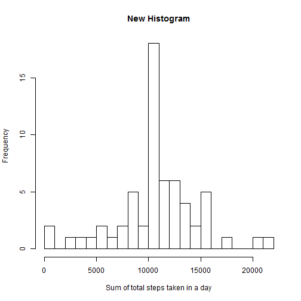

# Reproducible Research: Peer Assessment 1


## Loading and preprocessing the data

1. Original repo already contains dataset, so simply set the working directory and use `read.csv()` to read data. Use `header = TRUE` and `sep = ","` as defaults

2. Specify class of "date" column so class == `"Date"`


```r
setwd("C:/Sashwat/Sashwat/School/Data Science/Reproducible Research/PeerAssessment1")

data <- read.csv("activity.csv") ## data$date reads in as class == "Factor"

str(data) 
```

```
## 'data.frame':	17568 obs. of  3 variables:
##  $ steps   : int  NA NA NA NA NA NA NA NA NA NA ...
##  $ date    : Factor w/ 61 levels "2012-10-01","2012-10-02",..: 1 1 1 1 1 1 1 1 1 1 ...
##  $ interval: int  0 5 10 15 20 25 30 35 40 45 ...
```

```r
data$date <- as.Date(data$date) ## processes/transforms data$date to class == "Date"

str(data)
```

```
## 'data.frame':	17568 obs. of  3 variables:
##  $ steps   : int  NA NA NA NA NA NA NA NA NA NA ...
##  $ date    : Date, format: "2012-10-01" "2012-10-01" ...
##  $ interval: int  0 5 10 15 20 25 30 35 40 45 ...
```


## What is mean total number of steps taken per day?

1. To make the histogram, use  `aggregate()` to create a dataframe that ignores NA values
   Then, call `hist()` with its arguments specified with various aesthetic elements.


```r
histdf <- aggregate(steps ~ date, data, sum) ## adds total steps for each day

hist(histdf$steps, breaks = 20, xlab = "Sum of total steps taken in a day", main = "Histogram")
```

 

2. Calculate mean and median by using the `mean()` and `median()` functions on histdf$steps

```r
mean(histdf$steps)
```

```
## [1] 10766
```

```r
median(histdf$steps)
```

```
## [1] 10765
```

## What is the average daily activity pattern?

1. Create a time-series plot of the 5-minute intervals and the average steps taken during those intervals for each day

```r
timeseriesdata <- aggregate(steps ~ interval, data, mean)

plot(timeseriesdata$interval, timeseriesdata$steps, type = "l", xlab = "5-min interval",
     ylab = "Avg. steps taken", main = "Average number of steps taken per 5-min interval")  
```

 

2. The maximum interval where the individual took, on average, the maximum number of steps is 835 otherwise known as 8:35am

```r
timeseriesdata[timeseriesdata$steps == max(timeseriesdata$steps), ]
```

```
##     interval steps
## 104      835 206.2
```

## Inputing missing values

1. Calculate the number of missing values which is 2304

```r
sum(is.na(data$steps))
```

```
## [1] 2304
```

2. Substitute NA values with interval averages to create a new dataset that addresses missing values

3. Below is the code and `head()` of the `NA` replacement strategy from 2, above, creating a new dataset equal to the original dataset, with the missing data filled in.

```r
noNAdata <- data ## initialize no-NA dataframe with original data

noNAdata$steps <- ifelse(is.na(data$steps), 
                         timeseriesdata$steps[timeseriesdata$interval %in% data$interval],
                         data$steps) ## replace NA's with corresponding interval averages

head(noNAdata) ## the NA's are removed and replaced with interval averages
```

```
##     steps       date interval
## 1 1.71698 2012-10-01        0
## 2 0.33962 2012-10-01        5
## 3 0.13208 2012-10-01       10
## 4 0.15094 2012-10-01       15
## 5 0.07547 2012-10-01       20
## 6 2.09434 2012-10-01       25
```

4. Create a histogram that portrays the total steps per day and calculate new mean and median steps per day using all values including the originally missing values

```r
newhistdf <- aggregate(steps ~ date, noNAdata, sum) ## adds total steps for each day

hist(newhistdf$steps, breaks = 20, xlab = "Sum of total steps taken in a day", main = "New Histogram")
```

 

```r
mean(newhistdf$steps)
```

```
## [1] 10766
```

```r
median(newhistdf$steps)
```

```
## [1] 10766
```


## Are there differences in activity patterns between weekdays and weekends?

1. Set up a new column with two levels ("weekday" and "weekend") using `factor()` and class = `"Factor"`.

2. Calculate which days are weekdays and which days are weekends by creating a logical vector called `weekend` and using the  `weekdays()` function.

3. Calculate average steps per interval using `aggregate()` and plot using `xyplot()`.

4. After analyzing, it is clear that there is a set routine on weekdays, which involves a greater number of steps in the morning, whereas there is much more variability in steps on weekends.

```r
noNAdata$daytype <- factor("weekday", levels = c("weekday", "weekend")) ## new column that calculates if weekday or weekend

weekend <- weekdays(as.Date(noNAdata$date)) %in% c("Saturday", "Sunday") ## create logical vector

noNAdata$daytype[weekend == TRUE] <- "weekend" ## replace "weekday" with "weekend" when day == Sat/Sun

completeDataAgg <- aggregate(steps ~ interval + daytype, noNAdata, mean) ## get the complete average steps per interval across all days

options(warn = -1) ## cancel R package version warning

library(lattice) ## load lattice package

xyplot(steps ~ interval | daytype, completeDataAgg, type = "l", 
       layout = c(1,2), xlab = "Inteval", ylab = "Number of steps") ## plot data
```

